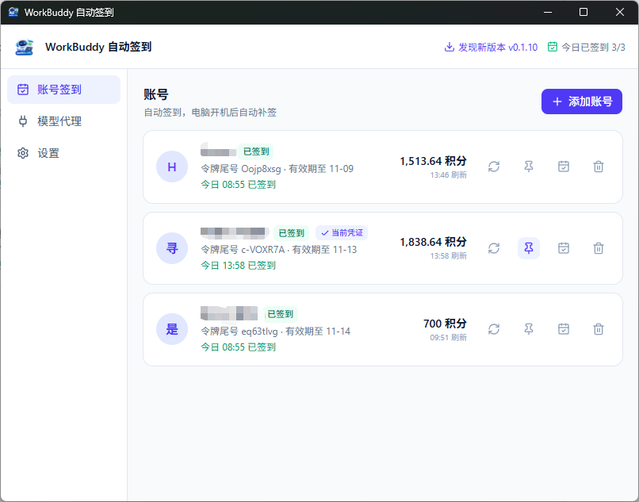

# workbuddy-checkin

一个桌面小工具：管理 CodeBuddy（腾讯，`copilot.tencent.com`）账号并**自动完成每日签到**，电脑没开时开机自动补签。

无需服务器、无需数据库、无需开端口——数据只存在本机。

支持 Windows 与 macOS，两平台行为略有差异：

| | Windows | macOS |
|---|---|---|
| 形态 | 中文安装向导（per-user，无需管理员）/ 绿色版单文件 exe | 未签名 `.dmg`（arm64 / amd64）|
| 常驻方式 | 系统托盘，关闭窗口最小化到托盘 | 无托盘，关闭窗口即退出应用 |
| 开机自启 | HKCU Run 注册表 | LaunchAgent |
| 应用内更新 | 下载 exe 自替换重启 | 下载 dmg 后挂载，拖入 Applications |

## 功能特性

- **自动签到**：常驻托盘，每小时巡检一次；应用启动、系统唤醒/解锁时立即补签，当天没签上绝不放过
- **多账号**：逐个签到，账号间随机间隔 5~20 秒，降低上游风控风险
- **OAuth 登录**：点击「添加账号」自动拉起浏览器完成授权，令牌仅存本机（0600 权限）
- **积分可见**：账号卡片实时展示今日签到状态与积分余额，可手动刷新
- **凭证自愈**：临期自动续期；失效时标记「需重新登录」并通知，不会静默失败
- **零配置**：没有需要理解的配置项，装上、登录、然后什么都不用管

## 软件截图



## 下载安装

前往 [Releases](https://github.com/hosea3000/workbuddy-checkin/releases/latest) 下载：

| 文件 | 说明 |
|---|---|
| `workbuddy-checkin-amd64-installer.exe` | Windows 安装版，中文向导，无需管理员权限 |
| `workbuddy-checkin.exe` | Windows 绿色版单文件，双击即用 |
| `WorkBuddy-checkin-arm64.dmg` | macOS，Apple Silicon（M1/M2/M3/M4） |
| `WorkBuddy-checkin-amd64.dmg` | macOS，Intel 芯片 |

系统要求：Windows 10 1809+ / Windows 11（x64）；macOS 10.13+。

**macOS 用户注意**：应用未签名、未公证，首次打开可能被 Gatekeeper 拦截。若提示「无法验证开发者」，在终端执行一次去隔离即可：

```bash
xattr -cr "/Applications/WorkBuddy 自动签到.app"
```

也可在「系统设置 → 隐私与安全性」中点「仍要打开」。安装方式：打开 dmg，把应用拖入「应用程序」。不确定芯片型号时，「关于本机」中查看处理器。

## 使用

1. 启动应用，点击「添加账号」→ 自动打开浏览器完成 CodeBuddy 登录 → 卡片出现新账号
2. 关闭主窗口即最小化到托盘（Windows）/ 直接退出应用（macOS），Windows 下应用仍在后台调度签到
3. 签到结果通过系统通知告知；打开主界面可查看每个账号的今日状态与积分余额
4. Windows 如需退出，右键托盘图标选择「退出」（关闭窗口不会退出应用）；macOS 直接关闭窗口即退出

数据目录：Windows 为 `%APPDATA%\workbuddy-checkin\`，macOS 为 `~/Library/Application Support/workbuddy-checkin/`，可在设置页点「打开数据目录」直达。

## 隐私与安全

- **账号、令牌与签到数据仅保存在本机**，不上传任何第三方
- 令牌明文存储且权限为 0600（仅当前用户可读）
- 日志、界面、通知中**永不出现完整令牌**，界面只显示令牌末 8 位
- 网络访问 `copilot.tencent.com`（签到与登录）、GitHub（更新检查/下载，可关闭）
- **匿名使用统计（默认开启，可在设置页关闭）**：每天最多上报一次，仅包含应用版本号、操作系统、账号数量这三项，不含账号信息、令牌或任何个人信息。关闭后立即停止上报。

## 匿名使用统计

为了解软件的实际使用情况，应用会在开启该功能时每天最多上报一次以下内容：

```json
{"id":"<本机随机 UUID>","v":"0.1.4","os":"windows","arch":"amd64","accounts":2}
```

- `id` 为首次运行时随机生成，与任何账号信息无关；换机或重装会产生新值
- `accounts` 仅为已添加账号的**数量**，不含账号本身
- 可在「设置 → 帮助改进 WorkBuddy」中随时关闭；关闭后不再发起任何上报
- 上报失败时静默重试，不影响任何功能

服务端接口契约（供独立服务端项目对照）：`POST /ping`，请求体为上述 JSON，收到即返回 HTTP 200 且无响应体；客户端不读取响应体。防刷由服务端承担（按 IP 限速、新 `id` 突增检测）。


## 从源码构建

前置：Go 1.26、Node.js 22、[Wails CLI v2](https://wails.io/)（构建 Windows 安装器还需 NSIS；macOS 构建需在 macOS 上进行）。

```bash
# 1. 先构建前端：main.go 用 //go:embed all:frontend/dist，dist 被 gitignore，
#    全新 clone 若不先建前端，go build/test 会直接失败
cd frontend && npm install && npm run build && cd ..

# 2. 静态检查与测试
go vet ./... && go test ./...

# 3. 构建 Windows 产物
wails build -platform windows/amd64          # 绿色版 exe
wails build -nsis -installscope user -platform windows/amd64  # 安装版

# 4. 构建 macOS 产物（须在 macOS 上执行）
wails build -platform darwin/arm64           # Apple Silicon
wails build -platform darwin/amd64           # Intel
# 打包为 dmg（macOS 自带 hdiutil）
hdiutil create -volname "WorkBuddy 自动签到" -srcfolder build/bin/workbuddy-checkin.app \
  -ov -format UDZO build/bin/WorkBuddy-checkin-arm64.dmg

# 开发模式（热重载）
wails dev
```

发布：推送 `v*` tag，`.github/workflows/release.yml` 会构建 Windows exe、NSIS 安装器与 macOS 两个架构的 dmg 并创建 Release。

## 免责声明

本项目仅供**本人授权的 CodeBuddy 账号在本机使用**。请遵守 CodeBuddy 的服务条款，使用产生的任何后果由使用者自行承担。
